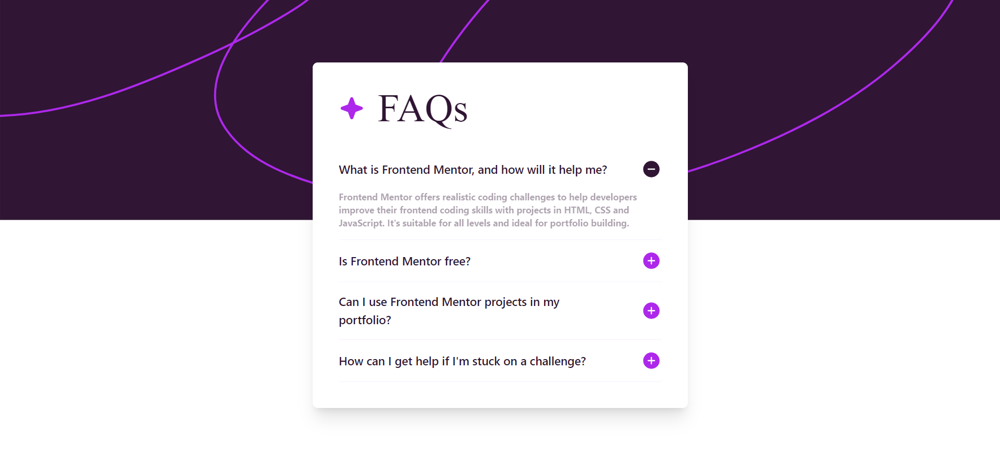

# Frontend Mentor - FAQ accordion solution

This is a solution to the [FAQ accordion challenge on Frontend Mentor](https://www.frontendmentor.io/challenges/faq-accordion-wyfFdeBwBz). Frontend Mentor challenges help you improve your coding skills by building realistic projects.

## Table of contents

- [Overview](#overview)
  - [The challenge](#the-challenge)
  - [Screenshot](#screenshot)
  - [Links](#links)
- [My process](#my-process)
  - [Built with](#built-with)
  - [What I learned](#what-i-learned)
- [Author](#author)

## Overview

### The challenge

Users should be able to:

- Hide/Show the answer to a question when the question is clicked
- Navigate the questions and hide/show answers using keyboard navigation alone
- View the optimal layout for the interface depending on their device's screen size
- See hover and focus states for all interactive elements on the page

### Screenshot

### Links

- Solution URL: [Add solution URL here](https://www.frontendmentor.io/solutions/accordion-with-react-and-shadcnui-and-tailwind-rQBT3cY6nO)
- Live Site URL: [Add live site URL here](https://master--accordion-react-shadcnui.netlify.app/)

## My process

### Built with

- [React](https://reactjs.org/) - JS library
- [Shadcn/ui](https://ui.shadcn.com/) - For Components
- [TailwindCSS](https://tailwindcss.com/) - For Styling
- Mobile-first workflow

### What I learned

This was my first experience with Shadcn/ui and I must admit that it is absolutely wonderful and makes the work much faster. I will definitely use it for my other projects as well. I needed a lot of researching for how to using it properly but at the end I think I did well.

## Author

- Frontend Mentor - [@MehrshadHeisenberg3](https://www.frontendmentor.io/profile/MehrshadHeisenberg3)
- Telegram - [@MehrshadHeisenberg3](https://t.me/MehrshadHeisenberg3)
- YouTube - [@CodeLabPlus](https://www.youtube.com/@Codelabplus)
